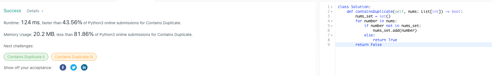

# :thought_balloon: Problem Statement
Given an array of integers, find if the array contains any duplicates.

Your function should return true if any value appears at least twice in the array, and it should return false if every element is distinct.

Example 1:
```
Input: [1,2,3,1]
Output: true
```

Example 2:
```
Input: [1,2,3,4]
Output: false
```

Example 3:
```
Input: [1,1,1,3,3,4,3,2,4,2]
Output: true
```

# :bulb: Solution Design
We create an empty set.

We go through each element in the array and check if it is in the set.

If it is not in the set, add it.

Else return true (because it means a duplicate exists).

(See the contains_duplicates_solution_implementation.py in the folder for the implementation)

# :white_check_mark: Solution Acceptance



# :pencil2: References

(Question source:https://leetcode.com/problems/contains-duplicate/)