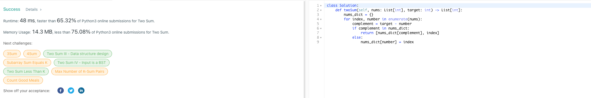

# :thought_balloon: Problem Statement
Given an array of integers nums and an integer target, return indices of the two numbers such that they add up to target.

You may assume that each input would have exactly one solution, and you may not use the same element twice.

You can return the answer in any order.

Example 1:
```
Input: nums = [2,7,11,15], target = 9
Output: [0,1]
Explanation: Because nums[0] + nums[1] == 9, we return [0, 1].
```

Example 2:
```
Input: nums = [3,2,4], target = 6
Output: [1,2]
```

Example 3:
```
Input: nums = [3,3], target = 6
Output: [0,1]
```

Constraints
```
- 2 <= nums.length <= 10^3
- 109 <= nums[i] <= 10^9
- 109 <= target <= 10^9
- Only one valid answer exists.
```

# :bulb: Solution Design
We check that the complement of each value is stored in a dictionary.

If not we add this current value and its index in a dictionary.

This process it repeated until a pair adding to the target is found.

Then we return both indices.

(See the two_sum_solution.py in the folder for the implementation)

# :white_check_mark: Solution Acceptance



# :pencil2: References

(Question source: https://leetcode.com/problems/two-sum/)