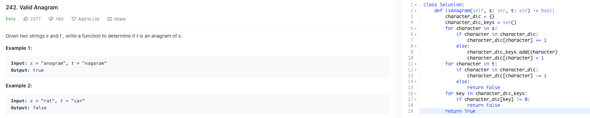

# :thought_balloon: Problem Statement
Given two strings s and t , write a function to determine if t is an anagram of s.

Example 1:
```
Input: s = "anagram", t = "nagaram"
Output: true
```

Example 2:
```
Input: s = "rat", t = "car"
Output: false
```

# :bulb: Solution Design
We add the character and character count in string s to a dictionary.

We decrease the character count in the dictionary as they appear in string t.

We then check that the characters count for all the characters in the dictionary is 0.

# :white_check_mark: Solution Acceptance



# :pencil2: References

(Question source: https://leetcode.com/problems/valid-anagram/)